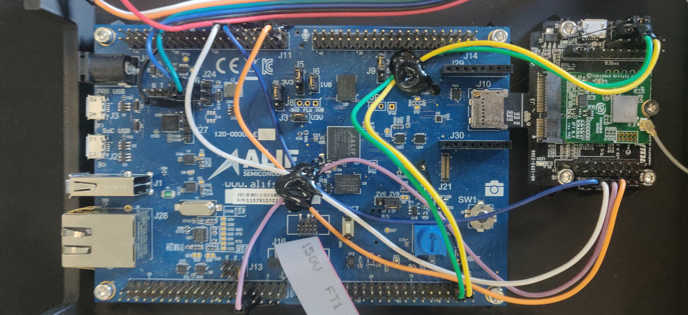
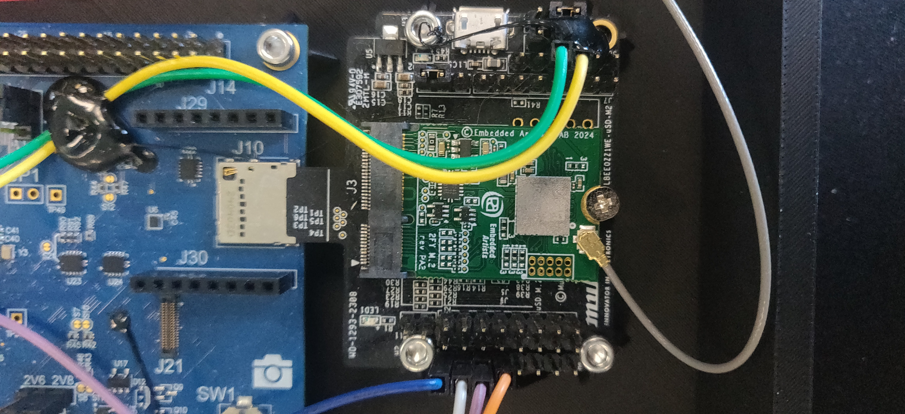

# alif-sample-app — branch `2FY-BLE`

This branch demonstrates **BLE** and **WiFi** connectivity on the Alif E7 devkit using the **Murata 2FY** module (Infineon CYW55513 / CYW43xxx).

- **BLE**: connectable advertising over HCI-UART on the HE core (RTSS-HE), H4 transport via UART3.
- **WiFi**: AIROC CYW55513 offload via SDHC (SDIO protocol).
- **Ethernet**: on-chip DWMAC with Realtek RTL8201FR PHY.

## Hardware

| Overview | Murata 2FY module |
|:-:|:-:|
|  |  |

> **Important:** Make sure the jumpers on the devkit are placed exactly as shown in the photos above before powering on the board.

## Pin-out

Pin assignment on the Alif E7 devkit.

### UART3 — BLE HCI (CYW43xxx)

| Signal | Periph | Alif Pin | Direction | Description       |
| ------ | ------ | -------- | --------- | ----------------- |
| RX     | UART3  | P1_2     | Input     | HCI UART receive  |
| TX     | UART3  | P1_3     | Output    | HCI UART transmit |
| CTS    | UART3  | P7_2     | Input     | Flow control CTS  |
| RTS    | UART3  | P7_3     | Output    | Flow control RTS  |

115200 baud, hardware flow control enabled.

### GPIO — BT control

| Signal    | GPIO    | Alif Pin | Direction | Description              |
| --------- | ------- | -------- | --------- | ------------------------ |
| BT-REG-ON | gpio0.2 | P0_2     | Output    | BLE module enable (high) |

### GPIO — WiFi control

| Signal    | GPIO     | Alif Pin | Direction | Description               |
| --------- | -------- | -------- | --------- | ------------------------- |
| WL-REG-ON | gpio14.7 | P14_7    | Output    | WiFi module enable (high) |

The WiFi (AIROC CYW55513) is connected via the SoC SDHC interface.

### Ethernet (DWMAC)

| Signal     | Alif Pin | Signal     | Alif Pin |
| ---------- | -------- | ---------- | -------- |
| ETH_TXD0   | P6_0     | ETH_RXD0   | P11_3    |
| ETH_TXD1   | P10_5    | ETH_RXD1   | P11_4    |
| ETH_TXEN   | P10_6    | ETH_CRS_DV | P11_5    |
| ETH_REFCLK | P11_0    | ETH_RST    | P11_6    |
| ETH_MDIO   | P11_1    | ETH_IRQ    | P11_7    |
| ETH_MDC    | P11_2    |            |          |

Default MAC address: `00:16:3E:11:22:33`

### Wiring diagram

```
                    +------------------+
                    |   Murata 2FY     |
                    |  (CYW43xxx BLE)  |
   P1_2 (RX)  ---->| UART RX          |
   P1_3 (TX)  <----| UART TX          |
   P7_2 (CTS) ---->| CTS              |
   P7_3 (RTS) <----| RTS              |
   P0_2 (GPIO) --->| BT-REG-ON        |
                    +------------------+

                    +------------------+
                    |   Murata 2FY     |
                    |  (CYW55513 WiFi) |
   SDHC bus  <----->| SDIO             |
   P14_7 (GPIO) -->| WL-REG-ON        |
                    +------------------+

                    +------------------+
                    |   RTL8201FR      |
   DWMAC  <------->| RMII/MDIO        |
   P6/P10/P11      |                  |
                    +------------------+
```

---

## Getting started

### 1. Open in VSCode devcontainer

Open the repository folder in VSCode. When prompted, click **Reopen in Container** to start the devcontainer with all required tools pre-installed.

### 2. Initialize

Click the **⚙ Initialize** button in the status bar. This runs `west init -l project` and sets up the west workspace.

> This step is only needed once (or after a full clean).

### 3. Update

Click the **↻ Update** button. This fetches all west modules and the Infineon HAL blobs required for the Murata 2FY.

### 4. Configure — HE + HP with MCUboot

Click the **⊙ Configure** button and select:

- Core: **🔒 🟣 HE & HP with MCUboot**
- MRAM: choose whether to erase MRAM before flashing

### 5. Build

Click the **⊙ Build** button (or press `Ctrl+Shift+B`). This builds both the HE and HP applications with MCUboot.

### 6. Flash

Connect the devkit via USB, then click the **🚀 Flash** button. The firmware is written to MRAM via the Alif SE Tools.

### 7. Monitor serial output

Open the Serial Monitor (`ttyACM1`, **115200 baud**) to view the application logs from the HE core.

---

## Prerequisites

### Git & Docker

```bash
sudo apt install git
sudo apt install docker
sudo apt install docker-buildx
sudo usermod -aG docker $USER
```

### UDEV rules

```bash
wget -O 60-openocd.rules https://sf.net/p/openocd/code/ci/master/tree/contrib/60-openocd.rules?format=raw
sudo cp 60-openocd.rules /etc/udev/rules.d
sudo udevadm control --reload
```