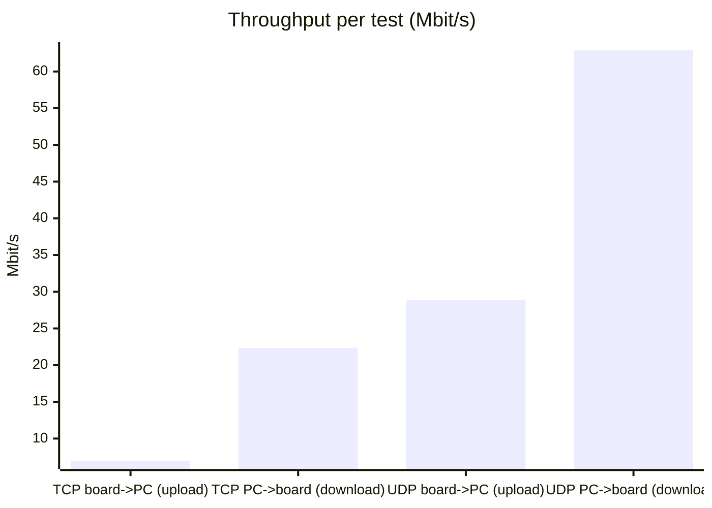

# Ethernet Throughput Report — HE core

*zperf ⇄ iperf 2.x · generated 2026-06-17 09:42:27*

| Setting | Value |
|---|---|
| Board (zperf) | `192.168.0.2` |
| PC (iperf) | `192.168.0.1` |
| Port | 5001 |
| Duration | 10 s |
| UDP target rate | 60M |

## Summary

| Test | Throughput | Packet loss | Jitter | Receiver |
|---|---:|---:|---:|---|
| TCP board->PC (upload) | 6.94 Mbits/sec | n/a (TCP) | n/a (TCP) | PC (iperf) |
| TCP PC->board (download) | 22.35 Mbps | n/a (TCP) | n/a (TCP) | board (zperf) |
| UDP board->PC (upload) | 28.9 Mbits/sec | 0/36182 (0 %) | 0.047 ms | PC (iperf) |
| UDP PC->board (download) | 62.9 Mbits/sec | ? | ? | board (zperf) |

## Throughput

```text
TCP ↑up    │████░░░░░░░░░░░░░░░░░░░░░░░░░░░░│   6.94 Mb/s
TCP ↓down  │███████████░░░░░░░░░░░░░░░░░░░░░│  22.35 Mb/s
UDP ↑up    │███████████████░░░░░░░░░░░░░░░░░│  28.90 Mb/s
UDP ↓down  │████████████████████████████████│  62.90 Mb/s
```



## Raw captures

<details>
<summary>TCP board->PC (upload)</summary>

**board (zperf)**

```text
zperf tcp upload 192.168.0.1 5001 10 1K
Remote port is 5001
Connecting to 192.168.0.1
Duration:	10.00 s
Packet size:	1000 bytes
Rate:		10 kbps
Starting...
-
Upload completed!
Duration:	10.00 s
Num packets:	8690
Num errors:	0 (retry or fail)
Rate:		6.95 Mbps
uart:~$
```

**PC (iperf)**

```text
------------------------------------------------------------
Server listening on TCP port 5001
TCP window size:  128 KByte (default)
------------------------------------------------------------
[  1] local 192.168.0.1 port 5001 connected with 192.168.0.2 port 40713
[ ID] Interval       Transfer     Bandwidth
[  1] 0.0000-10.0105 sec  8.29 MBytes  6.94 Mbits/sec
```

</details>

<details>
<summary>TCP PC->board (download)</summary>

**board (zperf)**

```text
$ zperf tcp download 5001
zperf tcp download 5001
TCP server started on port 5001
uart:~$
New TCP session started.
uart:~$ TCP session ended
uart:~$  Duration:		uart:~$ 10.03 suart:~$
uart:~$  rate:			uart:~$ 22.35 Mbpsuart:~$
uart:~$
$ zperf tcp download stop
zperf tcp download stop
TCP server stopped
uart:~$
```

**PC (iperf)**

```text
------------------------------------------------------------
Client connecting to 192.168.0.2, TCP port 5001
TCP window size: 85.0 KByte (default)
------------------------------------------------------------
[  1] local 192.168.0.1 port 34036 connected with 192.168.0.2 port 5001
[ ID] Interval       Transfer     Bandwidth
[  1] 0.0000-10.0426 sec  26.8 MBytes  22.3 Mbits/sec
```

</details>

<details>
<summary>UDP board->PC (upload)</summary>

**board (zperf)**

```text
zperf udp upload 192.168.0.1 5001 10 1K 60M
Remote port is 5001
Connecting to 192.168.0.1
Duration:	10.00 s
Packet size:	1000 bytes
Rate:		60000 kbps
Starting...
Rate:		60.00 Mbps
Packet duration 130 us
-
Upload completed!
LAST PACKET NOT RECEIVED!!!
Statistics:		server	(client)
Duration:		19.92 m	(10.00 s)
Num packets:		0	(36182)
Num packets out order:	0
Num packets lost:	688
Jitter:			30.37 m
Rate:			0 Kbps	(28.94 Mbps)
uart:~$
```

**PC (iperf)**

```text
------------------------------------------------------------
Server listening on UDP port 5001
UDP buffer size:  208 KByte (default)
------------------------------------------------------------
[  1] local 192.168.0.1 port 5001 connected with 192.168.0.2 port 64310
[ ID] Interval       Transfer     Bandwidth        Jitter   Lost/Total Datagrams
[  1] 0.0000-10.0007 sec  34.5 MBytes  28.9 Mbits/sec   0.047 ms 0/36182 (0%)
```

</details>

<details>
<summary>UDP PC->board (download)</summary>

**board (zperf)**

```text
$ zperf udp download 5001
zperf udp download 5001
UDP server started on port 5001
uart:~$
New session started.
art:~$ ASSERTION FAIL [z_spin_lock_valid(l)] @ WEST_TOPDIR/zephyr/include/zephyr/spinlock.h:136
uart:~$ 	Invalid spinlock 0x800a214
uart:~$ [00:09:20.843,000] <err> os: r0/a1:  0x00000004  r1/a2:  0x00000088  r2/a3:  0x00000001
uart:~$ [00:09:20.843,000] <err> os: r3/a4:  0x00000004 r12/ip:  0xffbb89a4 r14/lr:  0x8001ca5d
uart:~$ [00:09:20.843,000] <err> os:  xpsr:  0x01100000
uart:~$ [00:09:20.843,000] <err> os: s[ 0]:  0x00000000  s[ 1]:  0x80023fa1  s[ 2]:  0x00000000  s[ 3]:  0x00000000
uart:~$ [00:09:20.843,000] <err> os: s[ 4]:  0x80030124  s[ 5]:  0x2000892c  s[ 6]:  0x8001d776  s[ 7]:  0x80023947
uart:~$ [00:09:20.843,000] <err> os: s[ 8]:  0x00000088  s[ 9]:  0x800239b1  s[10]:  0x2000da70  s[11]:  0x2000892c
uart:~$ [00:09:20.843,000] <err> os: s[12]:  0x00000000  s[13]:  0x8001ca55  s[14]:  0x80030124  s[15]:  0x0800a214
uart:~$ [00:09:20.843,000] <err> os: fpscr:  0x200020f8
uart:~$ [00:09:20.843,000] <err> os: Faulting instruction address (r15/pc): 0x8002399c
uart:~$ [00:09:20.843,000] <err> os: >>> ZEPHYR FATAL ERROR 4: Kernel panic on CPU 0
uart:~$ [00:09:20.843,000] <err> os: Current thread: 0x200020f8 (sysworkq)
uart:~$ [00:09:20.972,000] <err> os: Halting system
uart:~$
$ zperf udp download stop
```

**PC (iperf)**

```text
------------------------------------------------------------
Client connecting to 192.168.0.2, UDP port 5001
Sending 1470 byte datagrams, IPG target: 186.92 us (kalman adjust)
UDP buffer size:  208 KByte (default)
------------------------------------------------------------
[  1] local 192.168.0.1 port 49073 connected with 192.168.0.2 port 5001
[ ID] Interval       Transfer     Bandwidth
[  1] 0.0000-10.0003 sec  75.0 MBytes  62.9 Mbits/sec
[  1] Sent 53503 datagrams
[  3] WARNING: did not receive ack of last datagram after 10 tries.
```

</details>

